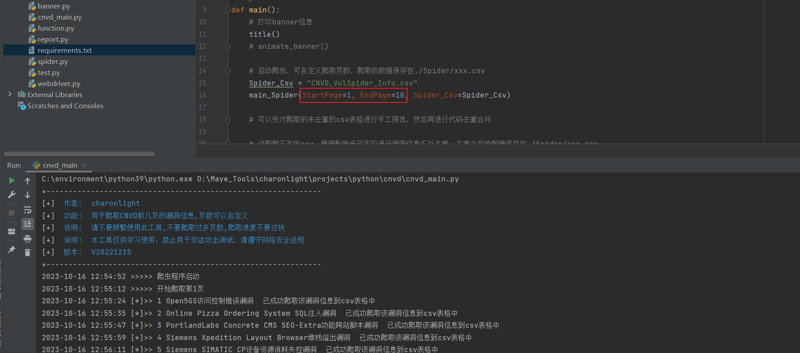
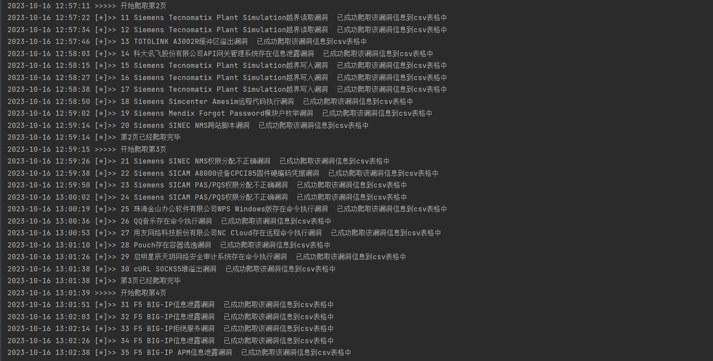
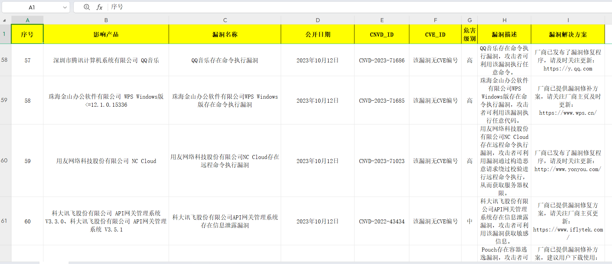
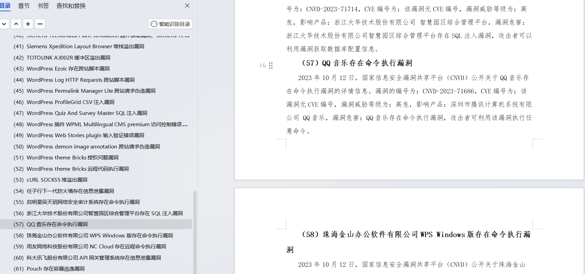

# cnvd_spider

### 0x01 工具使用说明

直接运行cnvd_main.py即可，爬虫效果图如下，爬虫结束之后会生成excel和word报告。该工具是在当安服仔的时候写的，现在已经很久没有更新，但是还能用。（该工具爬虫速度较慢，因为cnvd有waf和反爬机制，爬取速度过快会导致IP封禁）

### 0x02 免责声明

该开源工具是由作者按照开源许可证发布的，仅供个人学习和研究使用。作者不对您使用该工具所产生的任何后果负任何法律责任。

